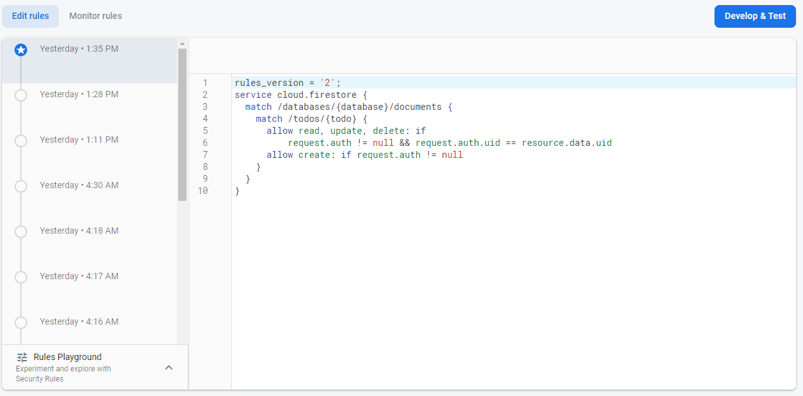

# Todo Manager
## Tech Stack
For this assignment, I learned how to use Firebase Authentication and Firestore to handle authentication with google and realtime database updates respectively. The data is persistent and is segregated by user. Firebase also allowed for easy deployment which is available [here](https://villvay-todo.web.app/). For the frontend I used React.js. 
## Usage
Sign in with Google popup on the home page. Create todos with the create todo button. Use the done button to toggle between the todo and done sections and the delete button to delete todos. Click anywhere else on the todo to edit the todo. Sign out with the sign out button.
## Testing Locally
To Test locally, clone the repo or download as zip and run
```
npm i  
npm start
```
## Security
Security is handled on firebase with firestore rules which makes sure that users are authenticated to submit todos and can only read and write their own todos.

